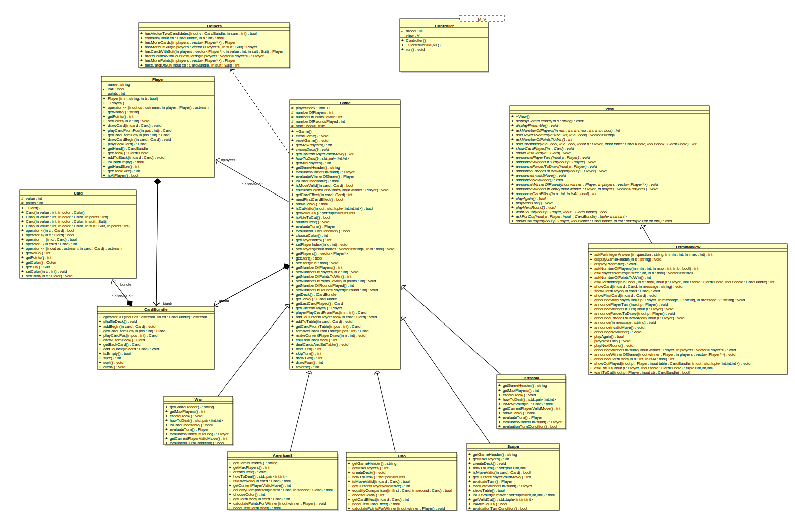

# CARD GAMES FRAMEWORK 

## The Model View Controller pattern

* Notre *framework* est basé sur un pattern **Model (Game) View Controller** simpliste.
* Ce *framework* est prévu pour supporter les jeux suivant 

	* **La bataille.** 
	* **Le Uno.**
	* **Le 8 Américain.**
	* **La Scopa.**
	* **La Briscola.**
	* **Le Tarot.**
	* **La Belote.**
	
D'autres jeux de cartes peuvent-être implémentés car beaucoup de méthodes sont re-définissable et rende le *framework* générique.

## UML Class diagram 

